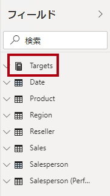

---
lab:
    title: 'Power BI Desktop での DAX 計算の作成、パート 1'
    module: 'モジュール 5: Power BI で DAX を使用してモデル計算を作成する'
---

# **Power BI Desktop での DAX 計算の作成、パート 1**

**このラボの推定所要時間: 45 分**

このラボでは、Data Analysis Expressions (DAX) を使用して、計算テーブル、計算列、および簡易メジャーを作成します。

このラボでは次の作業を行う方法について説明します。

- 計算テーブルを作成する

- 計算列を作成する

- メジャーを作成する

### **ラボ ストーリー**

このラボは、データの準備からレポートやダッシュボードとしての発行までの完全なストーリーとして設計された一連のラボのうちの 1 つです。ラボは任意の順序で完了できます。ただし、複数のラボを行う場合は、最初の 10 のラボを次の順序で行うことをお勧めします。

1. Power BI Desktop でのデータの準備

2. Power BI Desktop へのデータの読み込み

3. Power BI Desktop でのデータのモデル化、パート 1

4. Power BI Desktop でのデータのモデル化、パート 2

5. **Power BI Desktop での DAX 計算の作成、パート 1**

6. Power BI Desktop での DAX 計算の作成、パート 2

7. Power BI Desktop でのレポートの設計、パート 1

8. Power BI Desktop でのレポートの設計、パート 2

9. Power BI ダッシュボードを作成する

10. Power BI でのページ分割されたレポートの作成

11. Power BI Desktop におけるデータ分析の実施

## **演習 1: 計算テーブルを作成する**

この演習では、2 つの計算テーブルを作成します。最初のテーブルは **Salesperson** テーブルで、このテーブルと **Sales** テーブルとの間の直接のリレーションシップを許可します。2 つ目のテーブルは、**Date** テーブルです。

### **タスク 1: はじめに**

このタスクではこのラボ用の環境を設定します。

*重要: 前のラボから継続している (およびそのラボを完了している) 場合は、このタスクを完了しないで、次のタスクから続けてください。*

1. Power BI Desktop を開くには、タスク バーにある Microsoft Power BI Desktop のショートカットをクリックします。

 	

1. 「はじめに」ウィンドウを閉じるには、ウィンドウの左上にある「**X**」をクリックします。

 	

1. スターター Power BI Desktop ファイルを開くには、「**ファイル**」リボン タブをクリックして、バックステージ ビューを開きます。

1. 「**レポートを開く**」を選択します。

 	

1. 「**レポートを参照**」をクリックします。

 	

1. 「**開く**」ウィンドウで、**D:\DA100\Labs\05-create-dax-calculations-in-power-bi-desktop\Starter** フォルダーに移動します。

1. **Sales Analysis** ファイルを選択します。

1. 「**開く**」をクリックします。

 	

1. 開いている情報ウィンドウをすべて閉じます。

1. ファイルのコピーを作成するには、「**ファイル**」リボン タブをクリックして、バックステージ ビューを開きます。

1. 「**名前を付けて保存**」を選択します。

 	

1. 変更を適用するかどうかを確認するメッセージが表示されたら、「**適用**」をクリックします。

 	

1. 「**名前を付けて保存**」ウィンドウで、**D:\DA100\MySolution** フォルダーに移動します。

1. 「**保存**」をクリックします。

	

### **タスク 2: Salesperson テーブルを作成する**

このタスクでは、**Salesperson** テーブル (**Sales** への直接リレーションシップ) を作成します。

1. Power BI Desktop にある レポート ビューの「**モデリング**」リボンで、「**計算**」グループ内から「**新しいテーブル**」をクリックします。

	

2. 数式バー (計算の作成時または編集時にリボンの直下に表示される) に「**Salesperson =**」と入力し、**Shift+Enter** キーを押し、「**'Salesperson (Performance)'**」と入力し、**Enter** キーを押します。

	

	*利便性のために、このラボのすべての DAX 定義は、**D:\DA100\Labs\05-create-dax-calculations-in-power-bi-desktop\Assets\Snippets.txt** ファイルからコピーできます。*

	*計算テーブルを作成するには、最初にテーブル名を入力し、続けて等号 (=) と、テーブルが返される DAX 式を入力します。テーブル名はデータ モデルに存在できません。*

	*数式バーでは、有効な DAX 式の入力がサポートされています。オートコンプリート、Intellisense、色分けなどの機能が用意されているため、すばやく正確に数式を入力できます。*

	*このテーブル定義は、**Salesperson (Performance)** テーブルのコピーを作成します。コピーされるのはデータのみで、表示や書式設定などのモデル プロパティはコピーされません。*

	*ヒント: 数式が長くて複雑な場合は特に、直感的で読みやすい形式で数式をレイアウトするには、「空白」(改行やタブなど) を入力することをお勧めします。改行を入力するには、**Shift+Enter**キーを押します。"空白" は省略可能です。*

3. 「**フィールド**」ウィンドウで、テーブル アイコンが青色 (計算テーブルを示す) になっていることに注目します。

	

	*計算テーブルは、テーブルが返される DAX 式を使用して定義します。計算テーブルは、値を具体化して格納するため、データ モデルのサイズが大きくなることを理解しておくことが重要です。新しい (将来の) 日付値がテーブルに読み込まれるこのデータ モデルの場合のように、数式の依存関係が更新されるたびに再計算されます。*

	*Power Query に由来するテーブルとは異なり、計算テーブルを使用して外部データ ソースからデータを読み込むことはできません。既にデータ モデルに読み込まれている内容に基づいてのみ変換できます。*

4. モデル ビューに切り替えます。

5. **Salesperson** テーブルが使用可能であることを確認してください (非表示になっている可能性があります。その場合は水平方向にスクロールして見つけてください)。

6. **Salesperson | EmployeeKey** 列から **Sales | EmployeeKey** 列へのリレーションシップを作成します。

7. **Salesperson (Performance)** テーブルと **Sales** テーブルの間の非アクティブなリレーションシップを右クリックし、「**削除**」を選択します。

	

8. 削除の確認を求められたら、「**削除**」をクリックします。

	

9. **Salesperson** テーブルで、次の列を複数選択し、非表示にします (「**非表示**」プロパティを **はい** に設定します)。

	- EmployeeID

	- EmployeeKey

	- UPN

10. モデル ダイアグラムで、**Salesperson** テーブルを選択します。

11. 「**プロパティ**」ウィンドウの「**説明**」ボックスに、次のように入力します。**売上に関連する営業担当者**

	*ユーザーがカーソルをテーブルまたはフィールドの上に置くと、説明が「**フィールド**」ウィンドウにヒントとして表示されることを思い出すかもしれません。*

12. **Salesperson (Performance)** テーブルの説明を次の値に設定します。**地域に関連する営業担当者**

	*データ モデルは、営業担当者を分析する際に 2 つの代替手段を提供するようになりました。**Salesperson** テーブルでは、営業担当者による売上を分析でき、**Salesperson (Performance)** テーブルでは、営業担当者に割り当てられた販売地域での売上を分析できます。*

### **タスク 3: Date テーブルを作成する**

このタスクでは、**Date** テーブルを作成します。

1. データ ビューに切り替えます。

	

2. 「**ホーム** リボン タブの「**計算**」グループ内から、「**新しいテーブル**」をクリックします。

	

3. 数式バーに次のように入力します。


	**DAX**


	```
	Date =  
	‎CALENDARAUTO(6)
	```


	

	*CALENDARAUTO() 関数では、日付値で構成される単一列のテーブルが返されます。"auto" 動作は、すべてのデータ モデル日付列をスキャンして、データ モデルに格納されている最も古い日付と最新の日付値を判別します。次に、この範囲内の日付ごとに 1 行を作成し、範囲をいずれかの方向に拡張して、完全な年のデータが確実に格納されるようにします。*

	*この関数は、1 年の最後の月数である 1 つの省略可能な引数を受け取ることができます。省略した場合、その値は 12 になります。12 月が年度の最終月であるという意味です。この場合、6 が入力されます。これは、6 月がその年の最後の月であることを意味します。*

4. 日付値の列に注目してください。

	

	*表示される日付は、米国の地域設定を使用して書式設定されています (mm/dd/yyyy)。*

5. 左下隅のステータス バーに、テーブルの統計情報が表示されているのがわかります。1826 行のデータが生成されていることを確認します。これは 5 年間全体のデータを表します。

	

### **タスク 4:** **計算列を作成する**

このタスクでは、別の期間によるフィルター処理とグループ化を有効にする列を追加します。また、計算列を作成して、他の列の並べ替え順序の制御も行います。

1. 「**テーブル ツール**」コンテキスト リボンの「**計算**」グループ内から、「**新しい列**」をクリックします。

	

2. 数式バーに次のように入力 (またはスニペット ファイルからコピー) して、**Enter** キーを押します。


	**DAX**


	```
	Year =
	"FY" & YEAR('Date'[Date]) + IF(MONTH('Date'[Date]) > 6, 1)
	```


	*計算列を作成するには、最初に列名を入力し、続けて等号 (=) と、単一値の結果が返される DAX 式を入力します。列名がテーブルに既に存在できません。*

	*数式では、日付の年の値を使用しますが、月が 6 月の後の場合は年の値に 1 を加算します。このようにして、Adventure Works 社の会計年度が計算されます。*

3. 新しい列が追加されたことを確認します。

	

4. スニペット ファイルの定義を使用して、**Date** テーブルの次の 2 つの計算された列を作成します。

	- Quarter

	- Month

	

5. 計算を確認するために、レポート ビューに切り替えます。

6. 新しいレポート ページを作成するには、左下のプラス アイコンをクリックします。

	

7. 新しいレポート ページにマトリックス ビジュアルを追加するには、「**視覚化**」ウィンドウでマトリックス ビジュアルの種類を選択します。

	*ヒント: 各アイコンの上にカーソルを置くと、ビジュアルの種類について説明するヒントが表示されます。*

	

8. 「**フィールド**」ウィンドウの **Date** テーブル内から「**年**」フィールドを「**行**」ウェル/領域にドラッグします。

	

9. 「**月**」フィールドを「**年**」フィールドのすぐ下にある「**行**」ウェル/領域にドラッグします。

	

10. マトリックス ビジュアルの右上 (またはビジュアルの場所によっては下部) にある、分岐した二重矢印アイコンをクリックします  (すべての年を 1 レベル下に展開します) 。

	

11. 年が月に展開され、月が時系列順ではなくアルファベット順に並べ替えられていることがわかります。

	

	*既定では、テキスト値はアルファベット順に、数値は昇順に、日付は最も古いものから最も新しいものの順に並べ替えられます。*

12. 「**月**」フィールドの並べ替え順序をカスタマイズするには、データ ビューに切り替えます。

13. **Date** テーブルに **MonthKey** 列を追加します。


	**DAX**


	```
	MonthKey =
	(YEAR('Date'[Date]) * 100) + MONTH('Date'[Date])
	```


	*この数式により、年と月の各組み合わせに対する数値が計算されます。*

14. データ ビューで、新しい列に数値が含まれていることを確認します (201707 は 2017 年 7 月など)。

	

15. レポート ビューに戻ります。

16. 「**フィールド**」ウィンドウで、「**月**」フィールドが選択されていることを確認します (選択すると、背景は濃い灰色になります)。

17. 「**列ツール**」コンテキスト リボンの「**並べ替え**」グループ内から、「**列で並べ替え**」をクリックし、「**MonthKey**」を選択します。

	

18. マトリックス ビジュアル内で、月が時系列順に並べ替えられるようになったことがわかります。

	

### **タスク 5:** **Date テーブルを完成させる**

このタスクでは、列を非表示にして階層を作成することにより、**Date** テーブルの設計を完了します。次に、**Sales** テーブルと **Targets** テーブルへのリレーションシップを作成します。

1. モデル ビューに切り替えます。

2. **Date** テーブルで、**MonthKey** 列を非表示にします (「**非表示**」を **はい** に設定します)。

3. **Date** テーブルで、次の 3 つのレベルを持つ **Fiscal** という名前の階層を作成します。

	- Year

	- Quarter

	- Month

	

4. 次の 2 つのモデル リレーションシップを作成します。

	- **Date | Date** から **Sales | OrderDate**

	- **Date | Date** から **Targets | TargetMonth**

5. 次の 2 つの列を非表示にします。

	- Sales | OrderDate

	- Targets | TargetMonth

### **タスク 6: Date テーブルをマークする**

このタスクでは、**Date** テーブルを日付テーブルとしてマークします。

1. レポート ビューに切り替えます。

2. 「**フィールド**」ウィンドウで、**Date** テーブル (「**Date**」フィールドではなく) を選択します。

3. 「**テーブル ツール**」コンテキスト リボンの「**カレンダー**」グループ内から、「**日付テーブルとしてマーク**」をクリックし、「**日付テーブルとしてマーク**」を選択します。

	

4. 「**日付テーブルとしてマーク**」ウィンドウの「**日付列**」ドロップダウン リストで、「**日付**」を選択します。

	

5. 「**OK**」をクリックします。

	

6. Power BI Desktop ファイルを保存します。

	*これで、このテーブルによって日付 (タイム) が定義されていることが Power BI Desktop に認識されるようになりました。タイム インテリジェンスの計算を利用する場合に重要です。**Power BI Desktop での DAX 計算の作成、パート 2** ラボでは、タイム インテリジェンスの計算に取り組みます。*

	*データ ソースに日付テーブルがない場合は、日付テーブルに対してこの設計方法が適しています。データ ウェアハウスをお持ちの場合は、データ モデルで日付ロジックを「再定義」するのではなく、日付ディメンション テーブルから日付データをロードするのが適切です。*

## **演習 2: メジャーを作成する**

この演習では、いくつかのメジャーを作成して書式設定します。

### **タスク 1: 単純なメジャーを作成する**

このタスクでは、単純なメジャーを作成します。単純なメジャーは、単一の列の値を集計するか、テーブルの行をカウントします。

1. レポート ビューの「**ページ 2**」の「**フィールド**」ウィンドウで、「**Sales | Unit Price**」フィールドをマトリックス ビジュアルへドラッグします。

	*ラボでは、フィールドを参照するために省略表記を使用します。次のようになります。**Sales | Unit Price**。この例では、**Sales** はテーブル名、**Unit Price** はフィールド名です。*

	

	***Power BI Desktop でのデータのモデル化、パート 2** ラボでは、**Unit Price** 列を **平均** で要約するように設定しました。マトリックス ビジュアルに表示される結果は、月平均単価 (単価の値の合計を単価の数で割ったもの) です。*

2. ビジュアル フィールド ウィンドウ (「**視覚化**」ウィンドウの下) の「**値**」フィールドのウェル/領域に、「**Unit Price**」が一覧表示されていることに注目してください。

	

3. 「**Unit Price**」の下向き矢印をクリックすると、利用可能なメニュー オプションが表示されます。

	

	*表示可能な数値列を使用すると、レポートの作成者は、レポートのデザイン時に列の値をどのように集計するか (またはしないか) を決定できます。これにより、不適切な報告が発生する可能性があります。ただし、一部のデータ モデル作成者は、物事を偶然に任せたくないので、これらの列を非表示にし、メジャーで定義された集計ロジックを公開することを選択します。これは、このラボで採用するアプローチです。*

4. メジャーを作成するには、「**フィールド**」ウィンドウで **Sales** テーブルを右クリックし、「**新しいメジャー**」を選択します。

	

5. 数式バーに、次のメジャーの定義を追加します。


	**DAX**


	```
	Avg Price =  
	‎AVERAGE(Sales[Unit Price])
	```


6. 「**Avg Price**」メジャーをマトリックス ビジュアルに追加します。

7. 「**Unit Price**」列と同じ結果になります (ただし、書式設定は異なります)。

8. 「**値** ウェルで、「**Avg Price**」フィールドのコンテキスト メニューを開き、集計手法を変更できないことに注意してください。

	

	*メジャーの集計動作を変更することはできません。*

9. スニペット ファイルの定義を使用して、**Sales** テーブルに次の 5 つのメジャーを作成します。

	- Median Price

	- Min Price

	- Max Price

	- Orders

	- Order Lines

	*「**Orders**」メジャーで使用される DISTINCTCOUNT () 関数は、注文を 1 回だけカウントします (重複は無視されます)。「**Order Lines**」メジャーで使用される COUNTROWS() 関数は 、テーブルを介して動作します。*

	*この場合、注文の数は個別の **SalesOrderNumber** 列の値をカウントすることで計算されますが、注文の行の数は単にテーブルの行数です (各行は注文の行です)。*

10. モデル ビューに切り替えて、価格の 4 つのメジャーである**Avg Price**、**Max Price**、**Median Price**、**Min Price** を複数選択します。

11. 複数選択したメジャーに対して、次の要件を構成します。

	- 書式を小数点以下 2 桁に設定する

	- 「**Pricing**」という名前の表示フォルダーに割り当てる

	

12. **Unit Price** 列を非表示にします。

	*この時、レポート作成者は **Unit Price** 列を使用できません。モデルに追加した価格メジャーを使用する必要があります。このデザイン方法では、レポート作成者が不適切に価格を集計することができなくなります (たとえば、それらを合計する)。*

13. 「**Order Lines**」メジャーと「**Orders**」メジャーを複数選択し、次の要件を設定します。

	- 桁区切り記号を使用するように書式を設定する

	- 「**Counts**」という名前の表示フォルダーに割り当てる

	

14. レポート ビューにある、マトリックス ビジュアルの「**値**」ウェル/領域で、「**Unit Price**」フィールドの「**X**」をクリックして削除します。

	

15. ページの幅と高さに合わせて、マトリックス ビジュアルのサイズを大きくします。

16. マトリックス ビジュアルに次の 5 つのメジャーを追加します。

	- Median Price

	- Min Price

	- Max Price

	- Orders

	- Order Lines

17. 結果が適切に表示され、正しく書式設定されていることを確認します。

	

### **タスク 2: 追加のメジャーを作成する**

このタスクでは、より複雑な数式を使用する追加のメジャーを作成します。

1. レポート ビューで、「**ページ 1**」を選択します。

	

2. テーブル ビジュアルを確認し、**Target** 列の合計に注意します。

	

	*以前のラボで、営業担当者と地域の間に多対多のリレーションシップがあったことを思い出したかもしれません。営業担当者の目標は、各人の営業地域の割り当てに基づいて各人に設定されるため、目標値を合計しても意味がありません。目標値は、1 人の営業担当者がフィルター処理されている場合にのみ表示する必要があります。今から、それを行うためだけにメジャーを実装します。*

3. テーブル ビジュアルを選択し、「**視覚化**」ウィンドウで「**Target**」フィールドを削除します。

	

4. **Targets | Target** 列の名前を **Targets | TargetAmount** に変更します。

	*ヒント: レポート ビューで列の名前を変更するには、いくつかの方法があります。「**フィールド**」ウィンドウで列を右クリックし、「**名前の変更**」を選択するか、列をダブルクリックするか、または **F2** キーを押します。*

	*「**Target**」という名前のメジャーを作成しようとしています。列とメジャーを同じテーブルで同じ名前に設定することはできません。*

5. **Targets** テーブルで次のメジャーを作成します。


	**DAX**


	```
	Target =

	IF(

	HASONEVALUE('Salesperson (Performance)'[Salesperson]),

	SUM(Targets[TargetAmount])

	)
	```


	*HASONEVALUE() 関数は、 **Salesperson** 列の単一の値がフィルター処理されているかどうかをテストします。true の場合は、式によって (その営業担当者のみの) 目標金額の合計が返されます。false の場合は、空白が返されます。*

6. 小数点以下の桁数がゼロの「**Target**」メジャーを書式設定します。

	*ヒント: 「**メジャー ツール**」コンテキスト リボンを使用できます。*

7. **TargetAmount** 列を非表示にします。

	*ヒント: 「**フィールド**」ウィンドウで列を右クリックし、「**非表示**」 を選択します。*

8. 「**Target**」メジャーをテーブル ビジュアルに追加します。

9. **Target** 列の合計が空白になったことがわかります。

	

10. スニペット ファイル定義を使用して、**Targets** テーブルに次の 2 つのメジャーを作成します。

	- Variance

	- Variance Margin

11. 小数点以下の桁数がゼロの場合は、「**Variance**」メジャーを書式設定します。

12. 「**Variance Margin**」メジャーを小数点以下 2 桁の割合で書式設定します。

13. テーブル ビジュアルに「**Variance**」と「**Variance Margin**」メジャーを追加します。

14. すべての列と行が表示されるように、テーブル ビジュアルのサイズを変更します。

	

	*すべての営業担当者が目標を達成していないように見えますが、テーブル ビジュアルはまだ特定の期間でフィルタリングされていないことに注意してください。**Power BI Desktop でのレポートの設計、パート 1** ラボでは、ユーザーが選択した期間でフィルタリングする販売実績レポートを作成します。*

15. 「**フィールド**」ウィンドウの右上隅で、ウィンドウを折りたたんでから展開します。

	

	*ウィンドウを折りたたんで再び開くと、内容がリセットされます。*

16. **Targets** テーブルがリストの先頭に表示されるようになったことがわかります。

	

	*表示されるメジャーのみを含むテーブルは、自動的に一覧の先頭に表示されます。*

### **タスク 3: 仕上げ**

このタスクではラボを完了します。

1. Power BI Desktop ファイルを保存します。

2. 次のラボを開始する場合は、Power BI Desktop を開いたままにしておきます。

	***Power BI Desktop での DAX 計算の作成、パート 2** ラボでは、DAX を使用したより高度な計算によってデータ モデルを拡張します。*
