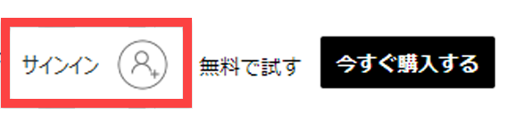
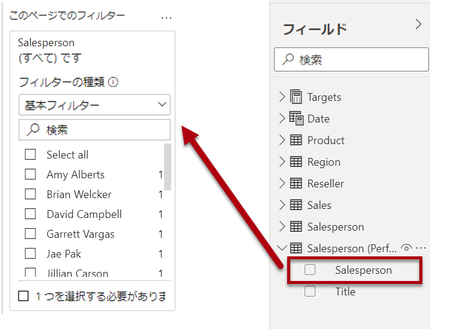

---
lab:
    title: 'Power BI Desktop でのレポートの設計、パート 1'
    module: 'モジュール 7 - レポートを作成する'
---

# **Power BI Desktop でのレポートの設計、パート 1**

**このラボの推定所要時間: 45 分**

このラボでは、3 ページのレポートを作成します。次に、Power BI にそれを発行し、そこでレポートを開いて操作します。

このラボでは次の作業を行う方法について説明します。

- レポートをデザインする

- ビジュアルのフィールドと書式プロパティを構成する

### **ラボ ストーリー**

このラボは、データの準備からレポートやダッシュボードとしての発行までの完全なストーリーとして設計された一連のラボのうちの 1 つです。ラボは任意の順序で完了できます。ただし、複数のラボを行う場合は、最初の 10 のラボを次の順序で行うことをお勧めします。

1. Power BI Desktop でのデータの準備

2. Power BI Desktop へのデータの読み込み

3. Power BI Desktop でのデータのモデル化、パート 1

4. Power BI Desktop でのデータのモデル化、パート 2

5. Power BI Desktop での DAX 計算の作成、パート 1

6. Power BI Desktop での DAX 計算の作成、パート 2

7. **Power BI Desktop でのレポートの設計、パート 1**

8. Power BI Desktop でのレポートの設計、パート 2

9. Power BI ダッシュボードを作成する

10. Power BI でのページ分割されたレポートの作成

11. Power BI Desktop におけるデータ分析の実施

## **演習 1: レポートを作成する**

この演習では、**売上レポート** という名前の 3 ページのレポートを作成します。

### **タスク 1: 開始する – サインイン**

このタスクでは、Power BI にサインインしてこのラボ用の環境を設定します。

*重要: Power BI にすでにサインインしている場合は、次のタスクから続行してください。*

1. Microsoft Edge を開くには、タスク バーの Microsoft Edge プログラムのショートカットをクリックします。

 	

1. Microsoft Edge ブラウザー ウィンドウで **https://powerbi.com** に移動します。

 	*ヒント: Microsoft Edge のお気に入りバーで Power BI サービスのお気に入りを使用することもできます。*

1. 「**サインイン**」 (右上隅) をクリックします。

 	

1. 提供されたアカウントの詳細を入力します (**リソース**を確認します)。

1. パスワードを更新するように求められたら、指定されたパスワードを再入力し、新しいパスワードを入力して確認します。

 	*重要: 新しいパスワードを必ず記録してください。*

1. サインイン プロセスを完了します。

1. Microsoft Edge からサインインを維持するかどうかを確認するメッセージが表示されたら、「**はい**」をクリックします。

1. Microsoft Edge ブラウザー ウィンドウを開いたままにします。

### **タスク 2: 開始する – レポートの作成**

このタスクでは、スターター レポートを開いてこのラボ用の環境を設定します。

*重要: 前のラボから継続している (およびそのラボを完了している) 場合は、このタスクを完了しないで、次のタスクから続けてください。*

1. Power BI Desktop を開くには、タスク バーにある Microsoft Power BI Desktop のショートカットをクリックします。

	

2. 「はじめに」ウィンドウを閉じるには、ウィンドウの左上にある「**X**」をクリックします。

	

3. Power BI サービスにサインインするには、右上の「**サインイン**」をクリックします。

	

4. Power BI サービスへのサインインに使用したものと同じアカウントを使用して、サインイン プロセスを完了します。

5. スターター Power BI Desktop ファイルを開くには、「**ファイル**」リボン タブをクリックして、バックステージ ビューを開きます。

6. 「**レポートを開く**」を選択します。

	

7. 「**レポートを参照**」をクリックします。

	

8. 「**開く**」ウィンドウで、**D:\DA100\Labs\07-design-report-in-power-bi-desktop\Starter** フォルダーに移動します。

9. **Sales Analysis** ファイルを選択します。

10. 「**開く**」をクリックします。

	

11. 開いている情報ウィンドウをすべて閉じます。

12. ファイルのコピーを作成するには、「**ファイル**」リボン タブをクリックして、バックステージ ビューを開きます。

13. 「**名前を付けて保存**」を選択します。

	

14. 変更を適用するかどうかを確認するメッセージが表示されたら、「**適用**」をクリックします。

	

15. 「**名前を付けて保存**」ウィンドウで、**D:\DA100\MySolution** フォルダーに移動します。

16. 「**保存**」をクリックします。

	

### **タスク 3: ページ 1 をデザインする**

このタスクでは、最初のレポート ページをデザインします。設計が完了すると、ページは次のようになります。

1. Power BI Desktop でページの名前を変更するには、左下の「**ページ 1**」を右クリックし、「**名前の変更**」を選択します。

	

	*ヒント: ページ名をダブルクリックして名前を変更することもできます。*

2. ページの名前を「**Overview**」に変更し、**Enter** キーを押します。

	

3. イメージを追加するには、「**挿入**」リボン タブの「**要素**」グループ内で、「**イメージ**」をクリックします。

	

4. 「**開く**」ウィンドウで、**D:\DA100\Resources** フォルダーに移動します。

5. **AdventureWorksLogo.jpg** ファイルを選択し、「**開く**」をクリックします。

	

6. 画像をドラッグして左上隅に配置し、ガイド マーカーをドラッグしてサイズを変更します。

	

7. スライサーを追加するには、まずレポート ページの空いている領域をクリックして画像を選択解除します。

8. 「**フィールド**」 ウィンドウで、「**日付**」 ステップを選択します。**| 年**フィールド (階層の**年**レベルではありません)。

	*ラボでは、フィールドを参照するために省略表記を使用します。次のようになります。**Date | Year**。この例では、**Date** はテーブル名、**Year** はフィールド名です。*

9. 年の値のテーブルがレポート ページに追加されていることに注意してください。

10. ビジュアルをテーブルからスライサーに変換するには、「**視覚化**」ウィンドウで「**スライサー**」を選択します。

	

11. スライサーをリストからドロップダウンに変換するには、スライサーの右上にある下矢印をクリックし、「**ドロップダウン**」を選択します。

	

12. イメージの下に配置され、イメージと同じ幅になるようにスライサーのサイズと位置を変更します。

	

13. **Year** スライサーで、ドロップダウン リストを開き、**FY2020** を選択してドロップダウン リストを折りたたみます。

	

	*レポート ページは、**2020 年度**でフィルター処理されるようになりました。*

14. レポート ページの空いている領域をクリックして、スライサーの選択を解除します。

15. **地域**に基づいて、2 番目のスライサーを作成する **| 地域**フィールド (階層の**地域**レベルではありません)。

16. スライサーをリストのままにして、**Year** スライサーでスライサーのサイズを変更し、配置します。

	

17. スライサーを書式設定するには、「**視覚化**」ウィンドウの下の「**書式設定**」ウィンドウを開きます。

	

18. 「**選択コントロール**」グループを展開します。

	

19. 「**「すべて選択」オプションを表示**」を「**オン**」に設定します。

	

20. **Region** スライサーで、最初の項目が「**すべて選択**」になっていることに注目します。

	*この項目を選択すると、すべて選択されるか、すべての項目が選択解除されます。レポート ユーザーが必要なスライサー項目を設定しやすくなります。*

21. レポート ページの空いている領域をクリックして、スライサーの選択を解除します。

22. ページにグラフを追加するには、「**視覚化**」ウインドウで、「**折れ線グラフと積み上げ縦棒グラフ**」ビジュアル タイプをクリックします。

	

23. ビジュアルをロゴの右側に配置し、レポート ページの幅と等しくなるようにサイズを変更します。

	

24. 次のフィールドをビジュアルにドラッグ アンド ドロップします。

	- Date | Month

	- Sales | Sales

25. ビジュアル フィールド ウィンドウで (「**フィールド**」ウィンドウではなく ビジュアル フィールド ウィンドウは「**視覚化**」ウィンドウの下にあります)、フィールドが「**共有軸**」および「**列の値**」ウェル/領域に割り当てられていることに注目してください。

	

	*ビジュアルをビジュアルにドラッグすると、既定のウェル/領域に追加されます。精度を高めるには、次に行うように、フィールドをウェル/領域に直接ドラッグできます。*

26. 「**フィールド**」ウィンドウから、「**Sales | Profit Margin**」フィールドを「**線の値**」ウェル/領域にドラッグします。

	

27. ビジュアルに 11 か月しかないことに注目してください。

	*2020 年 6 月の最後の月は、売り上げがありません (まだ)。デフォルトでは、ビジュアルは BLANK の売上で月を排除しました。次に、すべての月を表示するようにビジュアルを構成します。*

28. ビジュアル フィールド ウィンドウの「**共有軸**」ウェル/領域で、「**Month**」フィールドの下向き矢印をクリックし、「**データのないアイテムを表示**」を選択します。

	

29. **2020 年 6 月**が表示されるようになったことを確認してください。

30. レポート ページの空いている領域をクリックして、グラフの選択を解除します。

31. ページにグラフを追加するには、「**視覚化**」ウィンドウで、「**マップ**」ビジュアル タイプをクリックします。

	

32. ビジュアルのサイズを変更して縦棒/折れ線グラフの下に配置し、上のグラフの幅の半分になるようにします。

	

33. 次のフィールドをビジュアル ウェル/領域に追加します。

	- 場所: **Region | Country**

	- 凡例: **Product | Category**

	- サイズ: **Sales | Sales**

34. レポート ページの空いている領域をクリックして、グラフの選択を解除します。

35. ページにグラフを追加するには、「**視覚化**」ウィンドウで、「**積み上げ横棒グラフ**」ビジュアル タイプをクリックします。

	

36. ビジュアルのサイズを変更し、残りのレポート ページ領域を埋めるように配置します。

	

37. 次のフィールドをビジュアル ウェル/領域に追加します。

	- 軸: **Product | Category**

	- 値: **Sales | Quantity**

38. ビジュアルを書式設定するには、「**書式設定**」ウィンドウを開きます。

	

39. 「**データの色**」グループを展開し、「**既定の色**」プロパティを適切な色に設定します (縦棒グラフや折れ線グラフを補完する色)。

40. 「**データ ラベル**」プロパティを「**オン**」に設定します

	

41. Power BI Desktop ファイルを保存します。

	*最初のページのデザインが完了しました。*

### **タスク 4: ページ 2 をデザインする**

このタスクでは、2 番目のレポート ページをデザインします。設計が完了すると、ページは次のようになります。

*重要: ラボで詳細な手順が既に提供されている場合、ラボの手順ではより簡潔な手順が提供されます。詳細な手順が必要な場合は、このラボの他のタスクを参照してください。*

1. 新しいページを作成するには、左下にあるプラス アイコンをクリックします。

	

2. ページを「**Profit**」という名前に変更します。

	

  
‎ 

3. 「**Region | Region**」フィールドに基づいてスライサーを追加します。

4. 「**書式設定**」ウィンドウを使用して、(「**選択コントロール**」グループの) 「すべて選択」 オプションを有効にします。

5. スライサーのサイズを変更してレポート ページの左側に配置し、ページの高さの約半分になるようにします。

	

6. マトリックス ビジュアルを追加し、サイズを変更して配置して、レポート ページの残りの領域を埋めます

	

7. **Date | Fiscal** 階層をマトリックスの「**行**」ウェル/領域に追加します。

	

8. 次の 5 つの **Sales** テーブル フィールドを「**値**」ウェル/領域に追加します。

	- Orders (**数量**フォルダーから)

	- Sales

	- Cost

	- Profit

	- Profit Margin

	

9. 「**フィルター**」ウィンドウ (「**視覚化**」ウィンドウの左側) で、「**このページでフィルター**」ウェル/領域を確認します (下にスクロールする必要がある場合があります)。

	

10. 「**フィールド**」ウィンドウから、「**Product | Category**」フィールドを「**このページをフィルター**」ウェル/領域にドラッグします。

11. フィルター カード内の右上にある矢印をクリックして、カードを折りたたみます。

	

	*「**フィルター**」ウィンドウに追加されたフィールドは、スライサーと同じ結果を得ることができます。1 つの違いは、レポート ページのスペースを取らない点です。もう 1 つの違いは、より高度なフィルタリング要件を実現するように設定できることです。*

12. 「**このページのフィルター**」ウェル/領域に、次の各「**Product**」テーブル フィールドを追加し、それぞれを折りたたみ、「**カテゴリ**」カードの真下にします。

	- Subcategory

	- Product

	- Color

	

13. Power BI Desktop ファイルを保存します。

	*2 番目のページのデザインが完了しました。*

### **タスク 5: ページ 3 をデザインする**

このタスクでは、3 番目 (そして最後の) レポート ページをデザインします。設計が完了すると、ページは次のようになります。

1. 新しいページを作成し、「**My Performance**」に名前を変更します。

1. 行レベルのセキュリティ フィルターのパフォーマンスをシミュレートするには、**Salesperson (Performance) | Salesperson** フィールドをフィルター ウィンドウのページ レベル フィルターにドラッグします。
	
	 

1. 「**Michael Blythe**」を選択します。「**マイ パフォーマンス**」レポート ページの日付は、Michael Blythe のみのデータを表示するためにフィルター処理されています。

1. 「**Date | Year**」フィールドに基づいてドロップダウン スライサーを追加し、サイズを変更してページの左上隅に配置します。

	

1. スライサーで、ページを **FY2019** でフィルタリングするように設定します。

	

1. **複数行カード** ビジュアルを追加し、スライサーの右側に配置され、ページの残りの幅を塗りつぶすサイズと位置を変更します。

	

	

1. ビジュアルに次の 4 つのフィールドを追加します。

	- Sales | Sales

	- Targets | Target

	- Targets | Variance

	- Targets | Variance Margin

1. ビジュアルの書式設定:

	- 「**データ ラベル**」グループで、「**テキスト サイズ**」プロパティを **28pt** に増やします。

	- 「**背景**」グループで、「**色**」を薄い灰色に設定します。

	

1. **クラスター棒グラフ** ビジュアルを追加し、複数行カード ビジュアルの下に位置し、ページの残りの高さと、複数行カード ビジュアルの幅の半分になるようにサイズを変更します。

	

	

1. 次のフィールドをビジュアル ウェル/領域に追加します。

	- 軸: **Date | Month**

	- 値: **Sales | Sales** と **Targets | Target**

	

1. ビジュアルのコピーを作成するには、**Ctrl + C** キーを押し、**Ctrl + V** キーを押します。

1. 新しいビジュアルを元のビジュアルの右側に配置します。

	

1. 視覚化の種類を変更するには、「**視覚化**」ウィンドウで、**クラスター化された縦棒グラフ**を選択します。

	

	*2 つの異なる視覚化タイプで表現された同じデータを表示できるようになりました。これはページ レイアウトの使い方としてはあまりよくありませんが、**Power BI Desktop でのレポートの設計、パート 2** ラボでは、ビジュアルを重ね合わせることで改善します。ページにボタンを追加すると、レポート ユーザーは 2 つのビジュアルのうちどちらが表示されているかを判断できるようになります。*

	*3 ページ目 (最終ページ) のデザインが完成しました。*

### **タスク 6: レポートを発行する**

このタスクでは、レポートを発行します。

1. 「**Overview**」ページを選択します。

2. Power BI Desktop ファイルを保存します。

3. 「**ホーム**」リボン タブの「**共有**」グループ内で、「**発行**」をクリックします。

	

4. 「**Power BI に発行**」ウィンドウで、「**マイ ワークスペース**」が選択されていることを確認します。

5. レポートを発行するには、「**選択**」をクリックします。

	

6. 正常に発行されたら、「**了解**」をクリックします。

	

7. Power BI Desktop を開いたままにします。

	*次の演習では、Power BI サービスのレポートを探索します。*

## **演習 2: レポートを見る**

この演習では、Power BI に発行されたレポートを探索します。

### **タスク 1: レポートを探索する**

このタスクでは、Power BI に発行されたレポートを探索します。

1. Microsoft Edge ブラウザー ウィンドウの Power BI サービスの「**ナビゲーション**」ウィンドウ (左側、折りたたまれている場合があります) で、「**マイ ワークスペース**」を展開します。

	

2. **Sales Analysis**レポートとデータセットに注目して、ワークスペースの内容を確認します。

	*Power BI Desktop ファイルを発行したとき、データ モデルはデータセットとして発行されました。*

	*表示されない場合は、**F5** キーを押してブラウザーをリロードし、ワークスペースを再度展開します。*

	

3. レポートを開くには、**Sales Analysis** レポートをクリックします。

4. 左側の「**ページ**」ウィンドウで、「**Overview**」ページを選択します。 

5. **Regions** スライサーで、**Ctrl** キーを押しながら複数の地域を選択します。

6. 縦棒と折れ線のグラフで、任意の月の列を選択して、ページをクロスフィルター処理します。

7. **Ctrl** キーを押しながら、追加の月を選択します。

	*既定では、クロス フィルター処理によってページ上の他のすべてのビジュアルがフィルター処理されます。*

8. 横棒グラフがフィルター処理されて強調表示されており、横棒の太字部分がフィルター処理された月を表していることに注意してください。

9. 棒グラフ ビジュアルの上にカーソルを置き、右上のフィルター アイコンにカーソルを合わせます。

	

	*フィルター アイコンを使用すると、他のビジュアルからのスライサーとクロスフィルターも含めて、ビジュアルに適用されているすべてのフィルターがわかります。*

10. 横棒をポイントし、ヒントの情報を確認します。

11. クロスフィルターを取り消すには、縦棒と折れ線のグラフで、ビジュアルの空いている領域をクリックします。

12. マップ ビジュアルの上にカーソルを移動し、右上の「**フォーカス モード**」アイコンをクリックします。

	

	*フォーカス モードでは、ビジュアルが全ページ サイズに拡大されます。*

13. 円グラフのさまざまなセグメントをポイントして、ヒントを表示します。

14. レポート ページに戻るには、左上の **「レポートに戻る」** をクリックします。

	

15. もう一度マップ ビジュアルの上にカーソルを移動し、右上の省略記号 (..) をクリックして、メニュー オプションに注目します。

	

16. 「**Teams のチャット**」以外の各オプションを試してみてください。

17. 左側の「**ページ**」ウィンドウで、「**Profit**」ページを選択します。

	

18. **Region** スライサーは、「**Overview**」ページの **Region** スライサーとは異なる選択を行うことに注目してください。

	*スライサーが同期されていません。**Power BI Desktop でのレポートの設計、パート 2** ラボでは、ページ間で同期するようにレポートのデザインを修正します。*

19. 右側にある「**フィルター**」ウィンドウで、フィルター カードを展開し、いくつかのフィルターを適用します。

	*「**フィルター**」ウィンドウでは、スライサーとしてページに収められる以上のフィルターを定義できます。*

20. マトリックス ビジュアルで、プラス (+) ボタンを使用して、**Fiscal** 階層を展開します。

21. 「**My Performance**」ページを選択します。

	

22. メニュー バーの右上にある「**表示**」をクリックし、「**全画面表示**」を選択します。

	

23. スライサーを変更し、ページをクロスフィルター処理して、ページを操作します。

24. ウィンドウの下部で、ページを変更するコマンド、ページ間を前後に移動するコマンド、または全画面表示モードを終了するコマンドに注目してください。

25. 左側のアイコンをクリックして、全画面表示モードを終了します。

	

### **タスク 2: 仕上げ**

このタスクではラボを完了します。

1. ワークスペースに戻るには、ウィンドウのウェブ ページのバナーで、「**マイ ワークスペース**」をクリックします。

	

2. Microsoft Edge ブラウザー ウィンドウを開いたままにします。

	***Power BI Desktop でのレポートの設計、パート 2** ラボでは、高度な機能を使ってレポートのデザインを強化します。*
