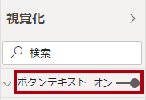

---
lab:
    title: 'Power BI Desktop でのレポートの設計、パート 2'
    module: 'モジュール 7: レポートの作成'
---

# **Power BI Desktop でのレポートの設計、パート 2**

**このラボの推定所要時間: 45 分**

このラボでは、 高度なデザイン機能を使用して、**販売分析**を強化します。

このラボでは次の作業を行う方法について説明します。

- スライサーの同期

- ドリルスルー ページの作成

- 条件付き書式の適用

- ブックマークの作成と使用

### **ラボ ストーリー**

このラボは、データの準備からレポートやダッシュボードとしての発行までの完全なストーリーとして設計された一連のラボのうちの 1 つです。ラボは任意の順序で完了できます。ただし、複数のラボを行う場合は、最初の 10 のラボを次の順序で行うことをお勧めします。

1. Power BI Desktop でのデータの準備

2. Power BI Desktop へのデータの読み込み

3. Power BI Desktop でのデータのモデル化、パート 1

4. Power BI Desktop でのデータのモデル化、パート 2

5. Power BI Desktop での DAX 計算の作成、パート 1

6. Power BI Desktop での DAX 計算の作成、パート 2

7. Power BI Desktop でのレポートの設計、パート 1

8. **Power BI Desktop でのレポートの設計、パート 2**

9. Power BI ダッシュボードを作成する

10. Power BI でのページ分割されたレポートの作成

11. Power BI Desktop におけるデータ分析の実施

## **演習 1: 同期スライサーを構成する**

この演習では、レポート ページ スライサーを同期します。

### タスク 1: 開始する – サインイン

このタスクでは、Power BI にサインインしてこのラボ用の環境を設定します。

*重要: Power BI にすでにサインインしている場合は、次のタスクから続行してください。*

1. Microsoft Edge を開くには、タスク バーの Microsoft Edge プログラムのショートカットをクリックします。

 	

1. Microsoft Edge ブラウザー ウィンドウで **https://powerbi.com** に移動します。

 	*ヒント: Microsoft Edge のお気に入りバーで Power BI サービスのお気に入りを使用することもできます。*

1. 「**サインイン**」 (右上隅) をクリックします。

 	

1. 提供されたアカウント詳細を入力します。

1. パスワードを更新するように求められたら、指定されたパスワードを再入力し、新しいパスワードを入力して確認します。

 	*重要: 新しいパスワードを必ず記録してください。*

1. サインイン プロセスを完了します。

1. Microsoft Edge からサインインを維持するかどうかを確認するメッセージが表示されたら、「**はい**」をクリックします。

1. Microsoft Edge ブラウザー ウィンドウの Power BI サービスの「**ナビゲーション**」ウィンドウで、「**マイ ワークスペース**」を展開します。

 	

1. Microsoft Edge ブラウザー ウィンドウを開いたままにします。

### タスク 2: 開始する – レポートの作成

このタスクでは、スターター レポートを開いてこのラボ用の環境を設定します。

*重要: 前のラボから継続している (およびそのラボを完了している) 場合は、このタスクを完了しないで、次のタスクから続けてください。*

1. Power BI Desktop を開くには、タスク バーにある Microsoft Power BI Desktop のショートカットをクリックします。

	

2. 「はじめに」ウィンドウを閉じるには、ウィンドウの左上にある「**X**」をクリックします。

	

3. Power BI サービスにサインインするには、右上の「**サインイン**」をクリックします。

	

4. Power BI サービスへのサインインに使用したものと同じアカウントを使用して、サインイン プロセスを完了します。

5. スターター Power BI Desktop ファイルを開くには、「**ファイル**」リボン タブをクリックして、バックステージ ビューを開きます。

6. 「**レポートを開く**」を選択します。

	

7. 「**レポートを参照**」をクリックします。

	

8. 「**開く**」ウィンドウで、**D:\DA100\Labs\08-design-report-in-power-bi-desktop-enhanced\Starter** フォルダーに移動します。

9. **Sales Analysis** ファイルを選択します。

10. 「**開く**」をクリックします。

	

11. 開いている情報ウィンドウをすべて閉じます。

12. ファイルのコピーを作成するには、「**ファイル**」リボン タブをクリックして、バックステージ ビューを開きます。

13. 「**名前を付けて保存**」を選択します。

	

14. 変更を適用するかどうかを確認するメッセージが表示されたら、「**適用**」をクリックします。

	

15. 「**名前を付けて保存**」ウィンドウで、**D:\DA100\MySolution** フォルダーに移動します。

16. 「**保存**」をクリックします。

	

### **タスク 3: スライサーの同期**

このタスクでは、「**Year**」と「**Region**」スライサーを同期します。

***Power BI Desktop でのレポートの設計、パート 1** ラボで作成したレポートの開発を続行します。*

1. Power BI Desktop の「**概要**」ページで、「**Year**」スライサーを「**FY2018**」に設定します。

2. 「**マイ パフォーマンス**」ページに移動し、**Year** スライサーの値が異なっていることを確認します。

	*スライサーが同期されていない場合、データの不正確性やレポート ユーザーの不満につながる可能性があります。それでは、レポート スライサーを同期します。*

3. 「**概要**」ページに戻り、「**Year**」スライサーを選択します。

4. 「**表示**」リボン タブの「**ペインの表示**」グループ内で、「**スライサーの同期**」をクリックします。

	

5. 「**視覚化**」ウィンドウの左側にある「**スライサーの同期**」ウィンドウで、2 番目の列 (同期を表す) で、「**概要**」ページと「**マイ パフォーマンス**」ページのチェック ボックスをオンにします。

	

6. 「**概要**」ページで、「**Region**」スライサーを選択します。

7. 「**概要**」ページと「**利益**」ページをスライサーと同期します。

	

8. 異なるフィルター オプションを選択し、同期されたスライサーが同じ選択でフィルター処理されることを検証します。

9. 「**スライサーの同期**」ページを閉じるには、ウィンドウの右上にある「**X**」をクリックします。

	

## **演習 2: ドリル スルーの構成**

この演習では、新しいページを作成し、ドリル スルー ページとして構成します。設計が完了すると、ページは次のようになります。

### **タスク 1: ドリルスルー ページを作成する**

このタスクでは、新しいページを作成し、ドリル スルー ページとして構成します。

1. 「**製品の詳細**」という名前の新しいレポート ページを追加します。

	

2. 「**製品の詳細**」ページ タブを右クリックし、「**ページの非表示**」を選択します。

	

	*レポート ユーザーは、ドリル スルー ページに直接移動できません。他のページのビジュアルからアクセスする必要があります。このラボの最後の演習で、ページをドリル スルーする方法を学習します。*

3. 「**視覚化**」ウィンドウの下の「**ドリル スルー**」セクションで、「**Product | Category**」フィールドを「**ここにドリルスルー フィールドを追加**」ボックスに追加します。

	*ラボでは、フィールドを参照するために省略表記を使用します。次のようになります。**Product | Category**。この例では、**Salesperson** はテーブル名、**Salesperson** はフィールド名です。*

	

4. ドリル スルー ページをテストするには、ドリル スルー フィルター カードで「**Bikes**」を選択します。

	

5. レポート ページの左上には矢印ボタンがあります。

	

	*フィールドがドリル スルー ウェル/領域に追加されると、ボタンが自動的に追加されます。これを使うと、レポート ユーザーがドリル スルー元のページに戻ることができます。*

6. ページに**カード** ビジュアルを追加し、サイズを変更して、ボタンの右側に配置し、ページの残りの幅を埋めるようにします。

	

	

7. 「**Product | Category**」フィールドをカード ビジュアルにドラッグします。

8. ビジュアルの書式オプションを構成し、「**カテゴリ ラベル**」プロパティを「**オフ**」にします。

	

9. 「**背景色**」プロパティを薄い灰色に設定します。

10. ページに「**テーブル**」ビジュアルを追加し、サイズを変更して、カード ビジュアルの下に配置し、ページ上の残りの領域を埋めます。

	

	

11. ビジュアルに次のフィールドを追加します。

	- Product | Subcategory

	- Product | Color

	- Sales | Quantity

	- Sales | Sales

	- Sales | Profit Margin

12. ビジュアルの書式オプションを構成し、「**グリッド**」セクションで、「**テキスト サイズ**」プロパティを **20pt** に設定します。

	*ドリル スルー ページのデザインはほぼ完了です。次の演習では、条件付き書式を使用してページを拡張します。*

## **演習 3：条件付き書式の追加**

この演習では、条件付き書式を使用してドリル スルー ページを拡張します。設計が完了すると、ページは次のようになります。

### **タスク 1: 条件付き書式を追加する**

このタスクでは、条件付き書式を使用してドリル スルー ページを拡張します。

1. テーブル ビジュアルを選択します。

2. 「視覚化」ウィンドウで、「**Profit Margin**」値の上の下矢印をクリックして、次に「**条件付き書式**」を選択します。| 「**アイコン**」を選択します。

	

3. 「**アイコン - Profit Margin**」ウィンドウの「**アイコン レイアウト**」ドロップダウン リストで、「**データの右**」を選択します。

	

4. 中央のルールを削除するには、黄色い三角形の左側にある「**X**」をクリックします。

	

5. 次のように、最初のルール (赤色のひし形) を構成します。

	- 2 番目のコントロールで、値を削除する

	- 3 番目のコントロールで、**数値**を選択する

	- 5 番目のコントロールに **0** と入力する

	- 6 番目のコントロールで、**数値**を選択する

6. 次のように、2 つ目のルール (緑色の円) を構成します。

	- 2 番目のコントロールに **0** と入力する

	- 3 番目のコントロールで、**数値**を選択する

	- 5 番目のコントロールで、値を削除する

	- 6 番目のコントロールで、**数値**を選択する

	

	*ルールは次のように解釈できます。利益率の値が 0 未満の場合は赤いひし形を表示します。それ以外の場合は、値が 0 以上の場合は、緑の円を表示します。*

7. 「**OK**」をクリックします。

	

8. テーブル ビジュアルで、正しいアイコンが表示されていることを確認します。

	

9. 「**色**」フィールドの背景色の条件付き書式を構成します。

10. 「**背景色 - 色**」ウィンドウの「**書式設定**」ドロップダウン リストで、「**フィールド値**」を選択します。

	

11. 「**フィールドに基づく**」ドロップダウン リストで、**「Product」 | 「書式設定」 | 「背景色の形式」** を選択します。

	

12. 「**OK**」をクリックします。

	

13. 上記の手順を繰り返して、 次を使用して「**色** フィールドのフォント色の条件付き書式を設定します。その際、**「Product」 | 「書式設定」 | 「フォント色の書式」** フィールドを使用します。

	*背景色とフォント色は、**Power BI Desktop でのデータの準備**ラボの **ColorFormats.csv** ファイルから取得し、**Power BI Desktop へのデータの読み込み**ラボの **Product** クエリに統合したことを思い出すかもしれません。*

## **演習 4: ブックマークとボタンを追加する**

この演習では、「**マイ パフォーマンス**」ページをボタンで拡張し、レポート ユーザーが表示するビジュアル タイプを選択できるようにします。設計が完了すると、ページは次のようになります。

### **タスク 1: ブックマークを追加する**

このタスクでは、月ごとの販売/目標ビジュアルを表示する 2 つのブックマークを追加します。

1. 「**マイ パフォーマンス**」ページに移動します。

2. 「**表示**」リボン タブの「**ペインの表示**」グループ内で、「**ブックマーク**」をクリックします。

	

3. 「**表示**」リボン タブの「**ペインの表示**」グループ内で、「**選択**」をクリックします。

	

4. 「**選択**」ウィンドウの「**月間売上と目標**」項目の横にあるビジュアルを非表示にするには、目のアイコンをクリックします。

	

5. 「**ブックマーク**」ウィンドウで、「**追加**」をクリックします。

	

6. ブックマークの名前を変更するには、ブックマークをダブルクリックします。

7. 表示されているグラフが横棒グラフの場合は、ブックマークの名前を「**横棒グラフ オン**」に、それ以外はブックマークの名前を「**縦棒グラフ オフ**」に変更します。

8. ブックマークを編集するには、「**ブックマーク**」ウィンドウでブックマークの上にカーソルを置き、省略記号をクリックして「**データ**」を選択します。

	

	*「**データ**」オプションを無効にすると、ブックマークは現在のフィルター状態を使用しません。これが重要なのは、そうしないとブックマークが **Year** スライサーによって現在適用されているフィルターに永久に固定されてしまうためです。*

9. ブックマークを更新するには、省略記号をもう一度クリックし、「**更新**」を選択します。

	

	*次の手順では、2 つ目のブックマークを作成して構成し、2 つ目のビジュアルを表示します。*

10. 「**選択**」ウィンドウで、2 つの「**月別売上と目標**」項目の表示を切り替えます。

	*つまり、表示されているビジュアルを非表示にし、非表示のビジュアルを表示します。*

	

11. 2 つ目のブックマークを作成し、適切な名前を付けます (「**縦棒グラフ オン**」または「**横棒グラフ オン**」)。

	

12. フィルターを無視するように 2 つ目のブックマークを設定し (「**データ**」オプションはオフ)、ブックマークを更新します。

13. 「**選択**」ウィンドウで、両方のビジュアルを表示するには、非表示のビジュアルを表示するだけです。

14. 両方のビジュアルのサイズと位置を変更して、マルチカード ビジュアルの下のページ全体に表示し、互いに完全に重なり合うようにします。

	*ヒント: 隠されたビジュアルを選択するには、「**選択**」ウィンドウで選択します。*

	

15. 「**ブックマーク**」ウィンドウで、各ブックマークを選択し、ビジュアルの 1 つだけが表示されていることを確認します。

	*デザインの次の段階は、ページに 2 つのボタンを追加することです。これで、レポート ユーザーはブックマークを選択できるようになります。*

### **タスク 2: ボタンを追加する**

このタスクでは、2 つのボタンを追加し、それぞれにブックマーク アクションを割り当てます。

1. 「**挿入**」リボンの「**要素**」グループから、「**ボタン**」をクリックしてから、「**空白**」を選択します。

	

2. **Year** スライサーの真下にボタンを配置します。

3. ボタンを選択し、「**視覚化**」ウィンドウで「**ボタン テキスト**」プロパティを「**オン**」にします。

	

4. 「**ボタン テキスト**」セクションを展開し、「**ボタン テキスト**」ボックスに「**横棒グラフ**」と入力します。

5. 「**背景**」セクションを展開し、補色を使用して背景色を設定します。

6. 「**アクション**」プロパティを「**オン**」にします (リストの下部近くにあります)。

	

7. 「**アクション**」セクションを展開し、「**種類**」ドロップダウンリストを「**ブックマーク**」に設定します。

8. 「**ブックマーク**」 ドロップダウン リストで、「**横棒グラフ ON**」 を選択します。

	

9. コピーと貼り付けを使用してボタンのコピーを作成し、次のように新しいボタンを構成します。

	*ヒント: コピーと貼り付けのショートカット コマンドは、**Ctrl+C** と **Ctrl+V** です。*

	- 「**ボタン テキスト**」プロパティを「**縦棒グラフ**」に設定します

	- 「**アクション**」セクションで、「**ブックマーク**」ドロップダウン リストを「**縦棒グラフ オン**」に設定します

	*これで、販売分析レポートのデザインが完了しました。*

### **タスク 3: レポートを発行する**

このタスクでは、レポートを発行します。

1. 「**概要**」ページを選択します。

2. 「**Year**」スライサーで、「**FY2020**」を選択します。

3. 「**Region**」スライサーで、「**すべて選択**」を選択します。

4. Power BI Desktop ファイルを保存します。

	*このファイルは、Power BI サービスに発行する前に必ず保存する必要があります。*

5. 「**ホーム**」リボン タブの「**共有**」グループ内で、「**発行**」をクリックします。

	

6. 「**Power BI に発行**」ウィンドウで、「**マイ ワークスペース**」が選択されていることを確認します。

7. レポートを発行するには、「**選択**」をクリックします。

	

8. データセットを置き換えるメッセージが表示されたら、「**置換**」をクリックします。

9. 正常に発行されたら、「**了解**」をクリックします。

	

10. Power BI Desktop を閉じます。

	*次の演習では、Power BI サービスのレポートを探索します。*

## **エクササイズ 5: レポートを見る**

この演習では、Power BI サービスのレポートを探索します。

### **タスク 1: レポートを探索する**

このタスクでは、Power BI サービスのレポートを探索します。

1. Microsoft Edge ブラウザー ウィンドウの Power BI サービスの「**ナビゲーション** ウィンドウで、**販売分析**レポートをクリックします。

2. ドリル スルー レポートをテストするには、「**概要**」ページの「**カテゴリ別数量**」ビジュアルで「**衣類**」バーを右クリックし、**「ドリルスルー」 | 「商品の詳細」** を選択します。

	

3. 「**商品の詳細**」ページは「**衣類**」用であることを確認します。

4. ソース ページに戻るには、ページの左上隅の矢印ボタンをクリックします。

5. 「**マイ パフォーマンス**」ページを選択します。

6. 各ボタンをクリックすると、別のビジュアルが表示されることに注目してください。

### **タスク 2: 仕上げ**

このタスクではラボを完了します。

1. ワークスペースに戻るには、ウィンドウのウェブ ページのバナーで、「**マイ ワークスペース**」をクリックします。

	

2. Microsoft Edge ブラウザー ウィンドウを開いたままにします。

3. Power BI Desktop で、「**マイ パフォーマンス**」ページに移動し、「**フィルター**」ウィンドウで「**営業担当者**」フィルター カードを削除します。

	

4. 「**概要**」ページを選択します。

5. Power BI Desktop ファイルを保存し、Power BI にレポートを再発行します。

6. Power BI Desktop を開いたままにします。

	***Power BI コンテンツの公開と共有**ラボでレポートを共有すると、レポートは行レベルのセキュリティを施行します。*
