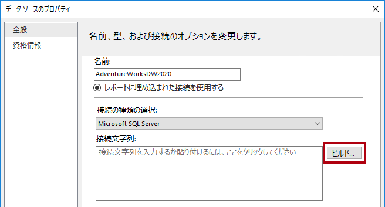
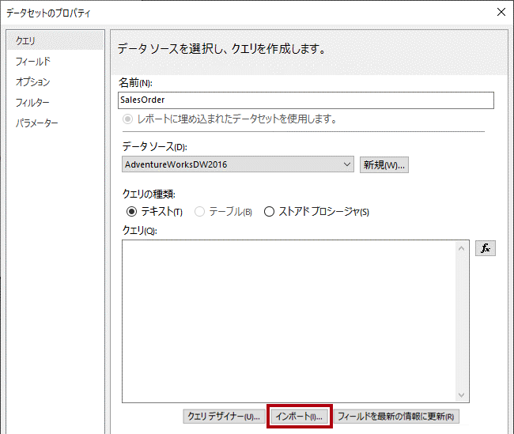

---
lab:
    title: 'Power BI でのページ分割されたレポートの作成'
    module: 'モジュール 9 - Power BI でのページ分割されたレポートの作成'
---


# **Power BI でのページ分割されたレポートの作成**

**このラボの推定所要時間: 45 分**

このラボでは、Power BI レポート ビルダーを使用して、**AdventureWorksDW2020** SQL サーバー データベースからデータをソースするピクセルに最適なページ分割されたレポート レイアウトを開発します。データ ソースとデータセットを作成し、レポート パラメーターも構成します。このレポート レイアウトを使用すると、データを複数のページにわたってレンダリングしたり、PDF やその他の形式でエクスポートしたりできます。

最終的なレポートは、以下のようなものになります。


このラボでは次の作業を行う方法について説明します。

- Power BI レポート ビルダーを使用する

- 複数ページのレポート レイアウトをデザインする

- データ ソースを定義する

- データセットの定義

- レポート パラメーターの作成

- レポートを PDF にエクスポートする

### **ラボ ストーリー**

このラボは、データの準備からレポートやダッシュボードとしての発行までの完全なストーリーとして設計された一連のラボのうちの 1 つです。ラボは任意の順序で完了できます。ただし、複数のラボを行う場合は、最初の 10 のラボを次の順序で行うことをお勧めします。

1. Power BI Desktop でのデータの準備

2. Power BI Desktop へのデータの読み込み

3. Power BI Desktop でのデータのモデル化、パート 1

4. Power BI Desktop でのデータのモデル化、パート 2

5. Power BI Desktop での DAX 計算の作成、パート 1

6. Power BI Desktop での DAX 計算の作成、パート 2

7. Power BI Desktop でのレポートの設計、パート 1

8. Power BI Desktop でのレポートの設計、パート 2

9. Power BI ダッシュボードを作成する

10. **Power BI でのページ分割されたレポートの作成**

11. Power BI Desktop におけるデータ分析の実施

## **演習 1: 作業開始**

この演習では、Power BI レポート ビルダーを開いてレポートを作成し、保存します。

### **タスク 1: レポートを作成する**

このタスクでは、Power BI レポート ビルダーを開いてレポートを作成し、保存します。

1. Power BI レポート ビルダーを開くには、タスク バーで **Power BI レポート ビルダー**のショートカットをクリックします。

 	
	
	*注: Power BI レポート ビルダーを最新バージョンに更新するように求められたら、「**キャンセル**」をクリックして、手順 2 に進みます。

1. Power BI レポート ビルダー ウィンドウで新しいレポートを作成するには、「**作業の開始**」ウィンドウで「**空白のレポート**」をクリックします。

 	

1. レポートを保存するには、左上にある「**ファイル**」タブをクリックし、「**保存**」を選択します。

 	

1. 「**レポートとして保存**」ウィンドウで、**D:\DA100\MySolution** フォルダーに移動します。

1. 「**名前**」ボックスに「**販売注文レポート**」と入力します。

1. 「**保存**」をクリックします。

## **演習 2: レポート レイアウトをデザインする**

この演習では、レポート レイアウトをデザインし、最終的なレポートのデザインを検討します。

### **タスク 1: レポート ヘッダーを構成する**

このタスクでは、レポート ヘッダーを構成します。

1. レポート デザイナーで、既定のレポート レイアウトを確認します。これは本文領域とレポート フッター領域で構成されています。

	

	*本文にはレポート タイトルのためのテキスト ボックスが 1 つ含まれ、レポート フッターにはレポートの実行時間を示すテキスト ボックスが 1 つ含まれています。*

	*既定のデザインでは、レポート タイトルは、最初にレンダリングされるページの本文内で 1 回だけレンダリングされます。しかしここでは、レポート ヘッダー領域を追加し、その領域内にレポート タイトル テキスト ボックスを移動することで、レポート デザインを変更します。これにより、レポート タイトルがすべてのページに繰り返し表示されるようになります。また、会社のロゴの画像も追加します。*

1. レポート ヘッダー領域を追加するには、「**挿入**」リボン タブの「**ヘッダーとフッター**」グループ内の「**ヘッダー**」をクリックし、「**ヘッダーの追加**」をクリックします。

	

1. レポート デザイナーで、レポート ヘッダー領域がレポート レイアウトに追加されていることを確認します。

1. 本文のテキスト ボックスを選択するには、「クリックしてタイトルを追加」テキスト ボックスをクリックします。

1. テキスト ボックスを移動するには、4 方向矢印アイコンをクリックし、ヘッダー領域にドラッグしてから、レポート ヘッダー領域の左上端にドロップします。

	

1. レポート タイトル テキスト ボックスのテキストを変更するには、テキスト ボックス内をクリックし、次のように入力します。**販売注文レポート**

	*テキスト ボックスのサイズを変更するには、まず「**プロパティ**」ウィンドウを開きます。場所とサイズのプロパティを詳細に制御するには、「**プロパティ**」ウィンドウを使用する必要があります。*

1. 「**表示**」リボン タブの「**表示/非表示**」グループ内で、「**プロパティ**」をオンにします。

	

1. レポート タイトル テキスト ボックスを選択するには、テキスト ボックスの外側の領域をクリックしてから、テキスト ボックスを再度クリックします。

	*テキストボックスの枠が強調表示され、サイズ変更ハンドル (小さな円) が枠線に表示される場合、テキストボックスが選択されています。*

1. 右側の 「**プロパティ**」 ペインで、リストを下にスクロールして 「**位置**」 グループを見つけます。

	

	*「**ポジション**」グループでは、レポート項目の場所とサイズの正確な値を設定できます。*

	*このラボで説明したとおりに値を入力することが重要です。ラボの最後にページ レンダリングを成功させるには、ピクセル単位で正確なレイアウトが必要です。*

1. 「**ポジション**」グループで、「**場所**」グループを展開し、「**左**」プロパティと「**上**」プロパティがそれぞれ「**0in**」に設定されていることを確認します。

	*ラボ仮想マシンの地域設定は米国に設定されているため、場所とサイズの単位はインチになっています。お住まいの地域でメートル法が使用されている場合は、センチメートルが既定の単位になります。*

1. 「**ポジション**」グループ内で、「**サイズ**」グループを展開し、「**幅**」プロパティを「**4**」に設定します。

	

1. イメージを挿入するには、「**挿入**」リボン タブの「**レポート アイテム**」グループ内で、「**イメージ**」をクリックします。

	

1. レポート デザインに画像を追加するには、レポート ヘッダー領域内で、レポート タイトル テキスト ボックスの右側をクリックします。

1. 「**イメージのプロパティ**」 ウィンドウで、イメージ ファイルからインポートする場合は、「**インポート**」 をクリックします。

	

1. 「**開く**」ウィンドウで、**D:\DA100\Resources** フォルダーに移動し、**AdventureWorksLogo.jpg** ファイルを選択します。

1. 「**開く**」をクリックします。

1. 「**イメージのプロパティ**」ウィンドウで、「**OK**」をクリックします。

1. レポート デザイナーで、画像が追加され、選択されていることを確認します。

1. イメージのポジションとサイズを変更するには、「**プロパティ**」ウィンドウで次のプロパティを構成します。

	- **ポジション | 場所 | 左** : 5

	- **ポジション | 場所 | 上** : 0

	- **ポジション | サイズ | 幅** : 1

	- **ポジション | サイズ | 高さ** : 1

1. レポート ヘッダー領域のサイズを変更するには、まず領域の空白部分をクリックして領域を選択します。

1. 「**プロパティ**」 ペインで、「**全般**」 を設定します。 **|** 「**高さ**」 プロパティを **1** にします。

1. レポート ヘッダー領域に 1 つのテキスト ボックスとイメージが含まれていることを確認します。次のようになります。

	

1. レポートを保存するには、「**ファイル**」タブで「**保存**」をクリックします。

	*ヒント: 左上にあるディスク アイコンをクリックすることもできます。*

	

	*これで、データベース クエリの結果を取得するようにレポートを構成する準備ができました。*

### **タスク 2: データを取得する**

このタスクでは、データ ソースとデータセットを作成して、**AdventureWorksDW2020** SQL サーバー データベースからクエリ結果を取得します。

1. 「**レポート データ**」ウィンドウ (左側) で、「**データ ソース**」フォルダーを右クリック し、「**データ ソースの追加**」を選択します。

	

	*クラウドまたはオンプレミスのデータベース、または Power BI データセットからデータを取得することができます。*

2. 「**データ ソースのプロパティ**」ウィンドウの「**名前**」ボックスで、テキストを **AdventureWorksDW2020** に置き換えます。

3. 「**接続の種類の選択**」ドロップダウンリストで、接続の種類を「SQL Server Analysis Services」から「**Microsoft SQL Server**」に変更します。

4. 接続文字列を作成するには、「**ビルド**」をクリックします。

	

5. 「**接続のプロパティ**」ウィンドウの「**サーバー名**」ボックスに、「**localhost**」と入力します。

	*ラボでは、**localhost** を使用して SQL Server データベースに接続します。ただし、独自のソリューションを作成する場合、これは推奨される方法ではありません。理由は、ゲートウェイ データ ソースが **localhost** を解決できないためです。*

6. 「**データベース名の選択または入力**」ドロップダウン リストで、**AdventureWorksDW2020** を選択します。

7. 「**OK**」をクリックします。

8. 「**データ ソースのプロパティ**」ウィンドウで「**OK**」をクリックします。

9. 「**レポート データ**」ウィンドウで、**AdventureWorksDW2020** データ ソースが追加されていることに注目してください。

	

10. データセットを作成するには、「**レポート データ**」ウィンドウで **AdventureWorksDW2020** データ ソースを右クリックし、「**データセットの追加**」を選択します。

	

	*レポート データセットは、目的と構造が Power BI データセットとは異なります。*

11. 「**データセットのプロパティ**」ウィンドウの「**名前**」ボックスで、テキストを **SalesOrder** に置き換えます。

12. 定義済みのクエリをインポートするには、「**インポート**」をクリックします。

	

13. 「**クエリのインポート**」ウィンドウで、**D:\DA100\Labs\10-create-power-bi-paginated-report\Assets** フォルダーに移動し、**SalesOrder.sql** ファイルを選択します。

14. 「**開く**」をクリックします。

15. 「**クエリ**」ボックスでクエリを確認し、クエリ テキストの一番下までスクロールします。

	*クエリ ステートメントの詳細を理解することは重要ではありません。これは、販売注文明細行の詳細を取得するように設計されています。WHERE 句には、クエリ結果を単一の販売注文に制限する述語が含まれています。ORDER BY 句は、行番号順で行が返されるようにします。*

16. クエリ パラメーターを表す WHERE 句で **@SalesOrderNumber** が使用されていることに注意してください。

	

	*クエリ パラメーターは、クエリの実行時に渡される値のプレースホルダーです。ここでは、レポート ユーザーに 1 つの販売注文番号の入力を求めるようにレポート パラメーターを構成し、それがクエリ パラメーターに渡されます。*

17. 「**OK**」 をクリックします。

18. 「**レポート データ**」 ペインで、**SalesOrder** データセットとそのフィールドが追加されていることに注目してください。

	

	*フィールドは、レポート レイアウト内のデータ領域を構成するために使用されます。これらは、データセット クエリ列から派生したものです。*

19. レポートを保存します。

### **タスク 3: レポート パラメーターを構成する**

このタスクでは、既定値を使用してレポート パラメーターを構成します。

1. 「**レポート データ**」ウィンドウで、「**パラメーター**」フォルダーを展開して、「**SalesOrderNumber**」レポート パラメーターを表示します。

	

	*データセットの作成時に、「**SalesOrderNumber**」レポート パラメーターが自動的に追加されました。これは、データセット クエリに「**@SalesOrderNumber**」クエリ パラメーターが含まれているためです。*

2. レポート パラメーターを編集するには、「**SalesOrderNumber**」レポート パラメーターを右クリックし、「**パラメーターのプロパティ**」を選択します。

	

3. 「**レポート パラメーターのプロパティ**」ウィンドウの左側で、「**既定値**」ページを選択します。

	

4. 「**値を指定**」オプションを選択します。

	

5. 既定値を追加するには、「**追加**」をクリックします。

6. 「**値**」ドロップダウン リストで、テキストを **43659** に置き換えます。

	

	*販売注文 43659 は、レポート デザインをテストするために最初に使用する値です。*

7. 「**OK**」をクリックします。

8. レポートを保存します。

	*次に、販売注文について説明するテキスト ボックスを追加して、レポート ヘッダー領域のデザインを完成させます。*

### **タスク 4: レポート ヘッダーのレイアウトを完成させる**

このタスクでは、テキスト ボックスを追加してレポート ヘッダー領域のデザインを完成させます。

1. レポート ヘッダー領域にテキスト ボックスを追加するには、「**挿入**」リボン タブの「**レポート アイテム**」グループ内で、「**テキスト ボックス**」をクリックします。

	

2. レポート ヘッダー領域内で、レポート タイトル テキスト ボックスのすぐ下をクリックします。

3. テキストボックス内に「**販売注文:** 」と入力し、続けてスペースを入力します。

4. プレースホルダーを挿入するには、入力したスペースの直後に右クリックし、「**プレースホルダーの作成**」を選択します。

	

5. 「**プレースホルダーのプロパティ**」ウィンドウの「**値**」ドロップダウン リストの右側にある「**fx**」ボタンをクリックします。

	

	*「**fx**」ボタンを使用すると、カスタム式を入力できます。この式が、販売注文番号を返すために使用されます。*

6. 「**式**」ウィンドウの「**カテゴリ**」リストで、「**パラメーター**」を選択します。

	

7. 「**値**」リストで、「**SalesOrderNumber**」パラメーターをダブルクリックします。

8. 式ボックスに、プログラムによる「**SalesOrderNumber**」レポート パラメーターへの参照が追加されたことを確認します。

	

9. 「**OK**」をクリックします。

10. 「**プレースホルダー プロパティ**」ウィンドウで、「**OK**」をクリックします。

11. レポート ヘッダー領域の空白部分をクリックし、新しいテキスト ボックスを選択します。

12. 「**プロパティ**」ウィンドウで、次のポジション プロパティを構成します。

	- **ポジション | 場所 | 左** : 0

	- **ポジション | 場所 | 上** : 0.5

	- **ポジション | サイズ | 幅** : 4

	- **ポジション | サイズ | 高さ** : 0.25

13. テキスト ボックス テキストの一部を書式設定するには、新しいテキスト ボックス内で**販売注文:** テキストのみを選択します。

	

14. 「**ホーム**」リボン タブの「**フォント**」グループ内から、「**太字**」コマンドをクリックします。

	

15. レポート ヘッダー領域に別のテキスト ボックスを追加し、テキスト**リセラー:** の後にスペースを入力します。

	*ヒント: キャンバスを右クリックし、「**挿入**」 **|** 「**テキスト ボックス**」を選択してテキストボックスを追加することもできます。*

16. スペースの後にプレースホルダーを挿入し、式を使用するようにプレースホルダーの値を設定します。

17. 「**式**」ウィンドウの「**カテゴリ**」リストで、「**データセット**」を選択します。

	

18. 式の値を **First(Reseller)** の値に基づいて指定します。

19. 「**プロパティ**」ウィンドウで、次のポジション プロパティを構成します。

	- **ポジション | 場所 | 左** : 0

	- **ポジション | 場所 | 上** : 0.75

	- **ポジション | サイズ | 幅** : 4

	- **ポジション | サイズ | 高さ** : 0.25

20. **リセラー:** テキストを太字で書式設定します。

21. レポート ヘッダー領域に 3 番目の (最後の) テキスト ボックスを追加し、テキスト**受注日:** の後にスペースを入力します。

22. スペースの後にプレースホルダーを挿入し、プレースホルダーの値を設定して、「**データセット**」カテゴリの「**First(OrderDate)**」の値に基づく式を使用します。

	

23. 日付値の書式を設定するには、「**プレースホルダー プロパティ**」ウィンドウで「**数値**」ページを選択します。

	

24. 「**カテゴリ**」リストで、「**日付**」を選択します。

	

25. 「**種類**」リストで、適切な日付形式を選択します。

26. 「**プレースホルダー プロパティ**」ウィンドウで、「**OK**」をクリックします。

27. 「**プロパティ**」ウィンドウで、次のポジション プロパティを構成します。

	- **ポジション | 場所 | 左** : 0

	- **ポジション | 場所 | 上** : 1

	- **ポジション | サイズ | 幅** : 4

	- **ポジション | サイズ | 高さ** : 0.25

28. **受注日:** テキストの書式を太字で設定します。

29. 最後に、レポート ヘッダー領域の空白部分をクリックします。

30. 「**プロパティ** ウィンドウで、「**高さ**」プロパティを **1.5** に設定します。

31. レポート ヘッダー領域が次のようになっていることを確認します。

	

32. レポートを保存します。

33. レポートをプレビューするには、「**ホーム**」リボン タブの「**ビュー**」グループ内で、「**実行**」をクリックします。

	

	*レポートを実行すると、レポートが HTML でレンダリングされます。レポート パラメーターのみ既定値が設定されているため、レポートは自動的に実行されます。*

34. 表示レポートが次のようになっていることを確認します。

	

35. デザイン ビューに戻るには、「**実行**」リボン タブの「**ビュー**」グループ内で、「**デザイン**」をクリックします。

	

	*次に、レポート本文にテーブルを追加して、書式設定されたレイアウトの販売注文明細行を表示します。*

### **タスク 5: テーブル データ領域を追加する**

このタスクでは、レポート本文にテーブル データ領域を追加します。

1. 「**挿入**」リボン タブの「**データ領域**」グループ内で、「**テーブル**」をクリックし、「**テーブルの挿入**」をクリックします。

	

2. テーブルを追加するには、レポート本文内の空白部分をクリックします。

3. 「**プロパティ**」ウィンドウで、次のポジション プロパティを構成します。

	- **ポジション | 場所 | 左** : 0

	- **ポジション | 場所 | 上** : 0

	*このテーブルには 5 つの列が表示されます。既定では、テーブル テンプレートには 3 つの列のみが含まれます。*

4. テーブルに列を追加するには、最後の列の任意のセル内を右クリックし、「**列の挿入**」 **|** 「**右**」を選択します。

	

5. 最後の手順を繰り返して、2 番目の新しい列を追加します。

6. 最初の列の 2 行目のセルにカーソルを合わせると、フィールド ピッカー アイコンが表示されます。

	

7. フィールド ピッカー アイコンをクリックし、「**明細行**」フィールドを選択します。

	

8. テーブルの最初の行 (ヘッダー) にテキスト値が含まれ、詳細行にフィールド参照が含まれていることを確認します。

	

9. 続く 4 つの列に、次のフィールドを順番どおりに追加します。

	- Product

	- Quantity

	- UnitPrice

	- Amount

10. テーブルのデザインが次のようになっていることを確認します。

	

11. レポートを保存します。

12. レポートをプレビューします。

	

	

	*このテーブルには、ヘッダーと 12 行の販売注文明細行が含まれます。テーブル レイアウトを書式設定すると、さまざまな改善を加えることができます。*

	*次のタスクでは、次の作業を行います。*

	- 背景色と太字のフォント スタイルを使用してテーブル ヘッダーの書式設定する

	- 列の幅を変更して、余分なスペースを削除し、長いテキスト値が折り返されないようにする

	- 最初の列の値を左揃えにする

	- 最後の 3 つの列の値を右揃えにする

	- 通貨記号を使用して通貨値を書式設定する (USD の場合)

	- テーブルの集計行を追加して書式設定する

### **タスク 6: テーブル データ領域を書式設定する**

このタスクでは、テーブル データ領域の書式を設定します。

1. デザイン ビューに戻ります。

2. テーブル内の任意のセルをクリックすると、灰色のセル ガイドが表示されます。

	

	*セル ガイドは、行または列全体を構成するのに役立ちます。*

3. テーブル ヘッダーを書式設定するには、ヘッダー行のガイドをクリックします。

	

	*行または列のガイドを選択すると、その行または列のすべてのセルが選択されます。各セルは、実際にはテキスト ボックスです。単一または複数のテキストボックスの書式設定は、「**プロパティ**」ウィンドウまたはリボン コマンドを使用して行うことができます。*

4. 「**プロパティ**」ウィンドウ (またはリボン) で、次のプロパティを構成します。

	- **塗りつぶし | BackgroundColor**: 濃い緑 (ヒント: 各色の上にカーソルを置くと、その名前が表示されます)

	- **フォント | 色** : 白

	- **フォント | フォント | FontWeight** : 太字

5. 最初の列のガイドを選択します。

	

6. 「**プロパティ**」ウィンドウで、**「ポジション」 | サイズ | 「幅」** プロパティを **0.5** に設定します。

7. 2 番目の列の幅を **2.5** に設定します。

8. **Ctrl** キーを押しながら、最後の 3 列のヘッダー テキスト ボックス (**数量**、**単価**、**金額**) を複数選択します。

9. 「**プロパティ**」ウィンドウ (またはリボン) で、**「位置合わせ」 | 「テキスト配置」** プロパティを「**右**」に設定します。

10. 「**明細行**」詳細テキストボックスを左揃えに設定します。

	

11. 「**ホーム**」リボン タブの「**番号**」グループ内から、最後の 2 つの詳細 (ヘッダーではない) テキスト ボックス (**単価** と **金額**) を通貨記号で書式設定します。

	

12. テーブルに集計行を追加するには、**数量**詳細テキスト ボックスを右クリックし、「**合計の追加**」を選択します。

	

13. テーブルのフッターを表す新しい行が追加され、式によって**数量**値の合計が評価されることに注意してください。

14. **金額**詳細テキスト ボックスに合計を追加するために、最後の手順を繰り返します。

15. 表のフッター行の最初のセルに、「**合計**」という語を入力します。

16. フッター行のすべてのテキスト ボックスを、太字で書式設定します。

17. テーブルのデザインが次のようになっていることを確認します。

	

18. テーブルの後にある空白を削除するには、レポート本文とレポート フッター領域の間にある破線の上にカーソルを置き、テーブルの下端に触れるまで上方向にドラッグします。

	

19. レポートを保存します。

20. レポートをレビューします。

21. 表示レポートが次のようになっていることを確認します。

	

22. 「**販売注文番号**」パラメーター ボックスで、値を **51721** に置き換えます。

	

23. レポートを再実行するには、右側の「**レポートの表示**」をクリックします。

	

	*この販売注文には72 の販売注文明細行が含まれているため、データは多数のページにわたってレンダリングされます。*

24. レポートの 2 ページ目に移動するには、「**実行**」リボン タブの「**ナビゲーション**」グループ内から、「**次へ**」をクリックします。

	

25. ページ 2 ではテーブル ヘッダーが表示されないことに注意してください。

	*この問題は次のタスクで扱います。*

26. ページの一番下までスクロールすると、レポート フッターに実行時間のみが表示されます。

	*次のタスクでは、ページ番号を追加してフッター テキストを改善します。*

### **タスク 7: レポートのデザインを完成させる**

このタスクでは、複数ページのレポートを適切に表示して、レポートのデザインを完成させます。

1. デザイン ビューに切り替えます。

2. テーブル ヘッダーがすべてのページに繰り返し表示されるようにするには、まず、テーブルの任意のテキスト ボックスを選択します。

3. 「**グループ化**」 ペイン (レポート デザイナーの下部) の 「**列グループ**」 の右端にある下向き矢印をクリックし、「**詳細モード**」 を選択します。

	

4. 「**行グループ**」セクションで、最初の静的グループを選択します。

	

	*これにより、テーブル ヘッダー行が選択されました。*

5. 「**プロパティ**」ウィンドウで、**「その他」 | 「RepeatOnNewPage」** プロパティを「**True**」に設定します。

	*これにより、(テーブル ヘッダーを表す) 最初の静的グループが、すべてのページに繰り返し表示されます。*

6. テーブル フッター領域で、**ExecutionTime** テキスト ボックスを右クリックし、「**式**」を選択します。

	

7. 「**式**」ウィンドウの式ボックスにスペースを追加し、その後に **&amp; " | Page " &amp;** と続け、次の項目を生成します。


	**VB スクリプト**
	```
	=Globals!ExecutionTime & " | Page " &
	```


8. 最後のアンパサンド (&) の後にスペース 1 つがあることを確認します。

9. 「**カテゴリ**」 リストで、「**組み込みフィールド**」 を選択します。

	

10. ページ番号の値を式に挿入するには、「**項目**」リストで、「**PageNumber**」をダブルクリックします。

11. 式全体が次のようになっていることを確認します。

	

12. 「**OK**」をクリックします。

13. テキスト ボックスの左辺をドラッグして、レポート ページの幅になるまで幅を広げます。

	

	*これで、レポートのデザインが完成しました。最後に、ページ幅が正確に 6 インチに設定されていることを確認し、レポート パラメーターの既定値を削除します。*

14. レポートの本文を選択するには、任意のテーブルのテキスト ボックスを右クリックして、「**選択 | 本文**」 を選択します。

	

	*テーブルがレポート本文全体を占めているときにレポート本文を選択するには、この方法を使用する必要があります。*

15. 「**プロパティ**」ウィンドウで、**「ポジション」 | サイズ | 「幅」** プロパティが **6** に設定されていることを確認します。

	*印刷形式にレンダリングするとテーブルが複数のページにまたがるため、幅を 6 インチ以下にすることが重要です。*

16. 「**レポート データ**」ウィンドウで、「**SalesOrderNumber**」レポート パラメーターのプロパティを開きます。

17. 「**既定値**」ページで、「**既定値なし**」オプションを選択します。

	

18. 「**OK**」をクリックします。

19. レポートを保存します。

### **タスク 8: 最終的なレポートを確認する**

このタスクでは、印刷レイアウト モードでレポートを表示します。

1. レポートをプレビューします。

2. 「**販売注文番号**」パラメーター ボックスに、**51721** の値を入力します。

3. 「**実行**」リボン タブの「**印刷**」グループの「**印刷レイアウト**」をクリックします。

	

	*印刷レイアウト モードでは、厳密なページ サイズで印刷されたときのレポートの外観をプレビューできます。*

4. ページ 2 と 3 に移動します。

	*このラボではレポートを発行しません。ページ分割されたレポートは、専用容量のワークスペースに格納されていて、かつ、その容量でページ分割されたレポートのワークロードが有効になっている場合にのみ、Power BI サービスでレンダリングできます。これらの要件は、クラスには存在しません。*
